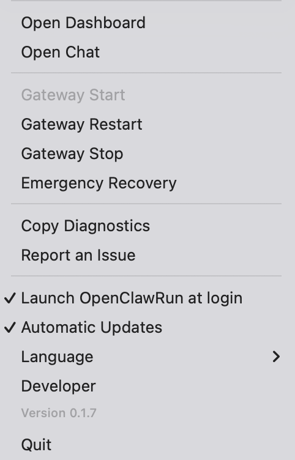

# OpenClawRun (日本語)

[← Language chooser](./README.md)

OpenClawRun は、OpenClaw Gateway をターミナル操作なしで扱うための macOS メニューバーアプリです。

## メニュープレビュー

## 配布方針
- このリポジトリは **配布・サポート専用** です
- ソースコードは非公開（closed source）運用です
- バイナリは [Releases](../../releases) で配布します

## ダウンロード
1. [Releases](../../releases) を開く
2. 最新の `OpenClawRun-*.dmg` をダウンロード
3. アプリを Applications にドラッグ

## 不具合報告
- [Issues](../../issues/new/choose)
- あると助かる情報:
  - macOS バージョン
  - OpenClawRun バージョン
  - OpenClaw バージョン（`openclaw --version`）
  - OpenClawRun の `Copy Diagnostics`

## 前提
- macOS 14+
- OpenClaw Gateway default: `127.0.0.1:18789`
