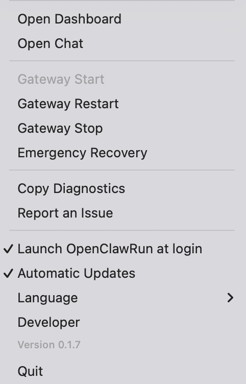

# OpenClawRun

OpenClawRun é um app de barra de menu para macOS que permite gerenciar o OpenClaw Gateway **sem abrir o Terminal**.  
É uma ferramenta prática para facilitar a operação do dia a dia, para qualquer perfil de usuário.

**Idiomas:** [English](./README.md) | [日本語](./README.ja.md) | [简体中文](./README.zh-Hans.md) | [繁體中文](./README.zh-Hant.md) | [Português (Brasil)](./README.pt-BR.md)

## Download

👉 **Baixar o DMG mais recente**  
<https://github.com/yamajinoboru/OpenClawRun/releases/latest>

- Formato de distribuição: DMG
- Instalação: abra o DMG e mova o OpenClawRun para Applications
- Após iniciar: use o ícone na barra de menu para controlar o Gateway (Start / Restart / Stop)

## Início rápido (3 passos)

1. Baixe o DMG mais recente no link acima
2. Abra o OpenClawRun (o ícone aparece na barra de menu)
3. Clique em `Start Gateway` e depois abra `Open Chat` / `Open Dashboard`

## Checklist dos primeiros 3 minutos

- [ ] O ícone aparece na barra de menu
- [ ] `Gateway Status` responde normalmente
- [ ] `Open Chat` abre corretamente
- [ ] `Open Dashboard` abre corretamente

## O que ele faz

- Executa `openclaw gateway start / restart / stop / status`
- Verifica conectividade localhost (`127.0.0.1:18789`)
- Roda diagnóstico em segundo plano a cada 30 segundos
- Faz recuperação automática (até 2 tentativas)
- Oferece Emergency Recovery (recuperação forçada)
- Copia informações de diagnóstico rapidamente
- Abre o fluxo de reporte de issues rapidamente
- UI multilíngue (ja / en / zh-Hans / zh-Hant / pt-BR)

## O que ele não faz

- Não envia seu conteúdo de chat para serviços externos por conta própria
- Não exige uso do Terminal no dia a dia
- Não exige permissões de Gravação de Tela, Acessibilidade ou Automação

## Permissões (por que são necessárias)

- Permissão padrão de execução de app (checagem do Gatekeeper para apps baixados)
- Acesso ao localhost (`127.0.0.1`) para conversar com o OpenClaw Gateway

Se o macOS bloquear a primeira abertura, use:
`Ajustes do Sistema → Privacidade e Segurança → Abrir Mesmo Assim`.

## Solução rápida de problemas (60 segundos)

1. Execute `Emergency Recovery` pela barra de menu
2. Tente `Start Gateway` novamente
3. Abra `Open Chat` ou `Open Dashboard` de novo
4. Se ainda falhar, copie os diagnósticos e abra uma issue

## FAQ

- **Abriu, mas continua sem responder.**  
  Execute `Emergency Recovery` pela barra de menu.

- **Stop/Restart está desativado.**  
  Isso é esperado quando o Gateway está parado. Execute `Start Gateway` primeiro.

- **Onde reporto bugs?**  
  <https://github.com/yamajinoboru/OpenClawRun/issues/new/choose>
